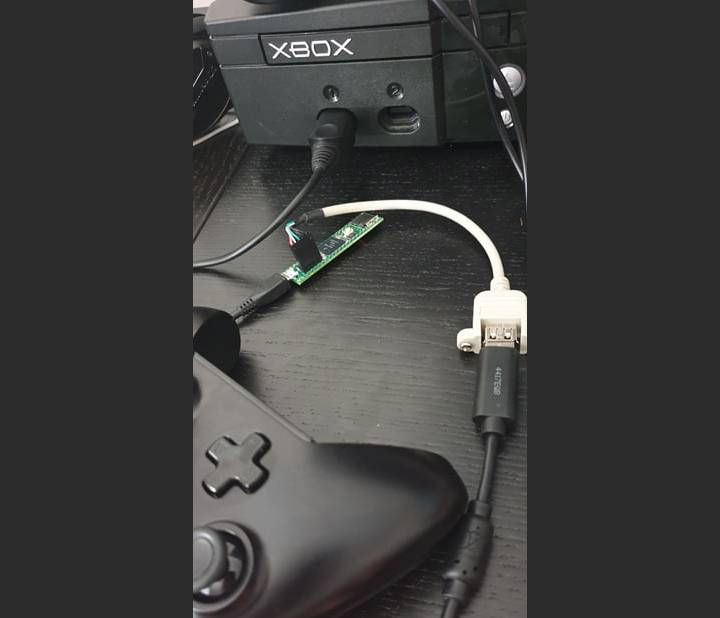

## ogx360_t4


A port of https://github.com/Ryzee119/ogx360.git, a project to use modern USB game controllers on the original Xbox console to the Teensy4.1.  

This has a new USB Host Stack, USB Device Stack and significantly more processing power which opens up alot more possibilities.

Finally, hardly any soldering is required.

## Currently can emulate
- Duke Standard Controller
- Official Xbox memory unit (XMU)
- Steel Battalion Controller

## Needed Parts
| Qty | Part Description | Link |
|--|--|--|
| 1 | Teensy 4.1 | https://www.pjrc.com/store/teensy41.html |
| 1 | USB Host Cable | https://www.pjrc.com/store/cable_usb_host_t36.html |
| 1 | 0.1" Pin Header | https://www.pjrc.com/store/header_24x1.html |
| 1 | Winbond W25Q128 SPI Flash (128Mbit) | (Only needed for XMU emulation) |
| 1 | Xbox to MicroUSB | [ChimericSystems](https://www.chimericsystems.com/product/micro-usb-to-xbox-cable/) or [Alibaba (Large MOQ!)](https://www.alibaba.com/product-detail/for-XBOX-MicroUSB-Cable-for-Xbox_62222784495.html) or DIY |

## Duke Controller Emulation: Supported Controllers
- Bluetooth 8bitdo/compatible controllers via the [8BitDo Wireless USB Adapter](https://www.8bitdo.com/wireless-usb-adapter/)
- Wired 8bitdo controllers when they are started in X-input mode.
- Xbox S/X Wired
- Xbox One Wired (Genuine / PDP)
- Xbox 360 Wired
- Xbox 360 Wireless (Via PC USB Receiver)
- PS4 Wired

## Xbox Memory Unit Emulation (XMU): Supported Memory Interface
- 256kB RAM disk for testing only
- 16MB SPI flash chip. Requires soldering onto the designated Teensy4.1 footprint.

## Steel Battalion Controller Emulation: Supported Interface
- Keyboard and Mouse See [this file](/src/steelbattalion.cpp) for mapping. Please improve!

## Compile
### CLI (Requires python and python-pip)
```
git clone https://github.com/Ryzee119/ogx360_t4.git --recursive
python -m pip install --upgrade pip
pip install platformio
cd ogx360_t4
# Build XMU (memory unit) emulator
platformio run -e XMU
# Build controller translator
platformio run -e DUKE
# Build steel battalion translator
platformio run -e STEELBATTALION
```
### Visual Studio Code
* Download and install [Visual Studio Code](https://code.visualstudio.com/).
* Install the [PlatformIO IDE](https://platformio.org/platformio-ide) plugin.
* Clone this repo recursively `git clone https://github.com/Ryzee119/usb64.git --recursive`
* In Visual Studio Code `File > Open Folder... > ogx360_t4`
* Hit build on the Platform IO toolbar (`✓`).

## Program
### Teensy (using Teensy Loader)
* Connect the Teensy to your PC using a MicroUSB cable.
* Run the [Teensy Loader Application](https://www.pjrc.com/teensy/loader.html).

### Teensy (using Visual Studio Code)
* Setup Visual Studio Code as per the Compile instructions.
* Hit the program button on the Platform IO toolbar (`→`).

  
